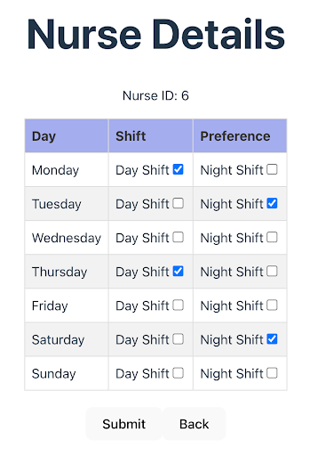
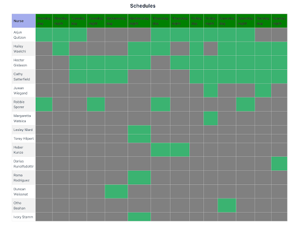

## Introduction

I developed a mini-scheduling system for nurses that incorporates shift requirements and preferences. The project involved full-stack TypeScript development, using NestJS and MySQL for the backend, Vite with React for the frontend.

## The exercise
My mini-scheduling system generates a simple weekly schedule based on shift requirements and nurse preferences.

There are seven days on a schedule, with two shifts per day: day and night. Shift requirements specify the required nurses for each shift each day (see `backend/src/shift/shiftRequirements.json`).

Don't care about actual dates or scheduling for multiple weeks. Only concerned with a single week.

I've implemented two main things: **nurse preference collection** and **schedule creation**. 

#### Nurse preferences
This application allows entry of nurse preferences. Preferences are stored as JSON on the `nurses` table. I decided an appropriate schema for this data and created an interface for user entry, as well as an API endpoint to save the preferences.

#### Schedule creation
I've implemented a scheduling algorithm in the `ScheduleService` that generates a weekly schedule for nurses (in `backend/src/schedule/schedule.service.ts`) based on their entered preferences and the shift requirements.

Developed a user interface that displays the weekly schedule for all nurses. 
  - The header displays the day of the week and indicate whether each shift type meets the requirements for that day.
  - Each row of the schedule should display the nurse's name and their assigned shift type for a given day.

The algorithm was designed in a manner such that nurse preferences were maximized while also filling all shift requirements.

## Up and running

1. Run `pnpm install` for both projects to install dependencies.
1. For the backend project, additionally:
    1. Run `docker-compose up` to start the MySQL database
    1. Run migrations to create and seed the database: `pnpm run migrations:run`
1. Run the backend server: `pnpm start:dev`
1. Run the frontend server: `pnpm dev`

The backend and frontend should now be running. Upon visiting https://localhost:3000 you should see a page showing nurses and shift requirements.

Below are screenshots of the application interface:

*Nurse preferences entry interface.*

*Weekly schedule view displaying nurses and their assigned shifts.*

